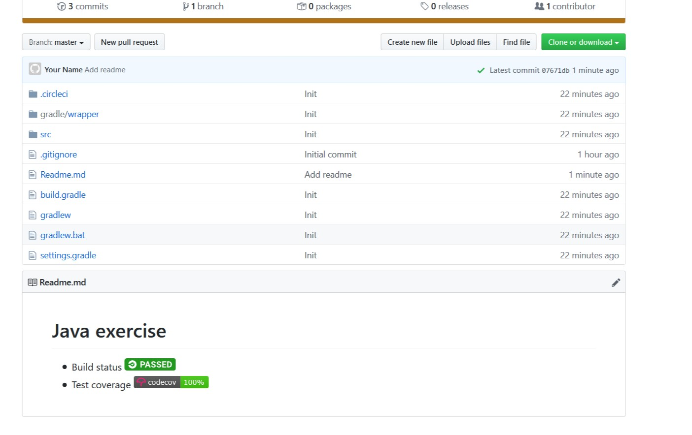

# Tạo repository

## 1. Đăng nhập github, chọn New repository


Trong phần New repository, đặt tên Repository, chọn Add.gitignore là java và sau đó Creat repository


## 2. Tạo project

Mở IntelliJ chọn File -> New -> Project
Sau đó chọn Project kiểu Gradle và tick vào Java trong Addtional Libraries and Framworks


 * Tiếp tục điền tên ứng dụng
 * Chú ý: Riêng phần Location(tích vào icon bên phải) hãy chọn ổ nào đó để lưu đừng lấy ổ C nghen.Ở trong bước này là ổ D, sau đó tạo một thư mục tên là code. Làm y như hình là được


## 3. Add sample code
Sau khi dự án được tạo, đợi một lúc để IDE đồng bộ cấu hình gradle từ template, ta sẽ được cái quần què này.Ai KHÔNG bị cái này thì bỏ qua nghen(cái lỗi dưới đây chỉ có Windows 10 thôi ai mà Windows 7 thích thì nghe không thích thì nghe) ta chọn Fix


Bấm xong nó sẽ ra như hình dưới chọn Configure Automatically


Rồi tiếp tục chọn Allow access


Sau khi dự án được tạo, đợi một lúc để IDE đồng bộ cấu hình gradle từ template

* Ta thêm class `Demo` vào gói main/java


Với nội dung

```java
public class Demo {
    public int sum(int x, int y){
        return x+y;
    }

    public int sub(int x, int y){
        return x-y;
    }

    public int multiple(int x, int y){
        return x*y;
    }
}
```
* Thêm class `DemoTest` vào gói test/java 


Với nội dung

```java
import org.junit.Test;

import static org.junit.Assert.assertEquals;

public class DemoTest {

    @Test
    public void test_sum(){
        assertEquals(new Demo().sum(2, 8), 10);
    }

    @Test
    public void test_sub(){
        assertEquals(new Demo().sub(8, 3), 5);
    }

    @Test
    public void test_multiple(){
        assertEquals(new Demo().multiple(8, 3), 24);
    }
}
```

Thêm xong nó ra thế này


Chạy DemoTest


Nếu kết quả nhận được toàn màu xanh là done


## 4. Cấu hình CircleCI và Codecov

Mở file build.gradle (xem mấy cái hình ở trên để biết cái file nó nằm ở đâu mà mở nghen)

Thay 

```
plugins {
    id 'java'
}
```

ở đầu file thành

```
apply plugin: 'java'
apply plugin: 'jacoco'
```

Thêm đoạn này vào cuối file

```
jacocoTestReport {
    reports {
        xml.enabled true
        html.enabled false
    }
}

check.dependsOn jacocoTestReport
```
Và kết quả như ảnh dưới đây


Tạo một thư mục tên là .circleci (nhấn chuột phải vào exercise chọn New -> Directory) và sau đó tạo 1 file tên là config.yml
với nội dung

```yml
# Java Gradle CircleCI 2.0 configuration file
#
# Check https://circleci.com/docs/2.0/language-java/ for more details
#
version: 2
jobs:
  build:
    docker:
      # specify the version you desire here
      - image: circleci/openjdk:8-jdk

      # Specify service dependencies here if necessary
      # CircleCI maintains a library of pre-built images
      # documented at https://circleci.com/docs/2.0/circleci-images/
      # - image: circleci/postgres:9.4

    working_directory: ~/repo

    environment:
      # Customize the JVM maximum heap limit
      JVM_OPTS: -Xmx3200m
      TERM: dumb

    steps:
      - checkout

      # Download and cache dependencies
      - restore_cache:
          keys:
            - v1-dependencies-{{ checksum "build.gradle" }}
            # fallback to using the latest cache if no exact match is found
            - v1-dependencies-

      - run: gradle dependencies

      - save_cache:
          paths:
            - ~/.gradle
          key: v1-dependencies-{{ checksum "build.gradle" }}

      # run tests!
      - run:
          name: Running test
          command: gradle test

      # Upload test coverage
      - run:
          name: Generate test coverage
          command: gradle jacocoTestReport

      # Upload test coverage
      - run:
          name: Upload test coverage
          command: bash <(curl -s https://codecov.io/bash) || echo "Codecov did not collect coverage reports"

```
Và kết quả như ảnh dưới đây


## 5. Đồng bộ project với github repository

Mở command line tại thư mục gốc của dự án(thư mục gốc là exercise chứ không phải là code) và gõ git init


Copy url của repository như hình (ở hình dưới là repository của mình còn các bạn lấy cái repository của các bạn nghen)


Rồi chạy lệnh `git remote add origin <url vừa copy>`


Tiếp tục chạy `git pull` để lấy code về


Qua bên IntelliJ IDEA chọn Always Add


Mở file .gitignore (Nếu mà không có file thì chạy tiếp git pull origin master)


Thêm các dòng này vào cuối file


```
build/**
.gradle/**
.idea/**
out/**
```


Sau đó đẩy code lên(chạy lần lượt và Enter từng dòng)

```
git add .circleci/config.yml
git add *
git commit -m Init
git push --set-upstream origin master
```
Chú ý:  Khi chạy dòng git commit -m Init
          (Nếu không hiện như hình dưới thì bỏ còn nếu hiện thì làm theo dưới đây) 
          


Chạy lần lượt 2 cái lệnh git config nó đã gợi ý như hình, riêng trong phần dấu ngoặc kép có thể đổi tên như ý muốn hoặc không .Ví dụ như

```
git config user.name "someone"
git config user.email "someone@someplace.com"
```

Chạy lại git commit -m Init

Sau đó hiện ra


Nếu đang thực hiện các lệnh trên đó tự nhiên hiện cái Login Github thì cứ đăng nhập vào thôi


Quay lại repository, reload lại trang web, ta sẽ thấy code đã được đẩy lên

## 6. Build code bằng circleCI

Đăng nhập circle ci trên trang https://circleci.com/vcs-authorize/, chọn phần Add projects


Tìm repository và bấm Set up Project. Sau đó chọn kiểu dự án là Gradle trên Linux


Sau đó bấm Start Building rồi bấm tiếp Start Building lần nữa (Nhớ thắp hương trước khi bấm).Đợi nó chạy đã.

Nếu bạn gặp may, nó sẽ xanh lè như thế này


Sau đó tìm chổ Project setting (bánh răng cưa phía trên bên phải), copy mã Embed Code trong phần Status Badges (cụ thể là Markdown) vào đâu đó đã, ở bước cuối ta sẽ tạo file Readme.md


## 7. Cấu hình Codecov

Vào trang https://codecov.io, đăng nhập bằng tài khoản github sau đó chọn repository hiện ra. 


Sau đó vào setting (Bánh răng cưa phía trên bên phải ) 


Chọn Badge và copy phần mã Markdown


## 8. Tạo file Readme.md

Vào Visual Studio Code chọn File -> New File


Với nội dung 

```
# Java exercise

- Build status <Code từ CircleCI>
- Test coverage <Code từ CodeCov>
```
nhớ là thay cái code place bằng code đã coppy như hình dưới


Sau đó lưu file này ở thư mục gốc dự án. Đặt tên file là Readme và Save as type là Markdown.Cuối cùng là Save


Đẩy file này lên bằng git như hình dưới


Tận hưởng thành quả



-------

# Done!!
